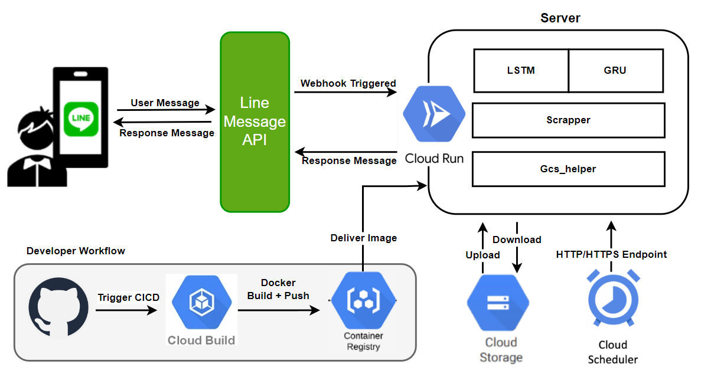

# EasyGood-StockAI
A project which deployed a AI server in Cloud Run, and interact with Line Message API in order to predict TWII with Line-bot.


## Quick Start

### Join Line Bot


### Requirements

* [ChromeDriver](https://googlechromelabs.github.io/chrome-for-testing/)
* GCP Credential Key
    * Windows PowerShell -> `$env:GOOGLE_APPLICATION_CREDENTIALS = "{PATH_TO_KEY_JSON}"`
    * MacOS / Linux -> `export GOOGLE_APPLICATION_CREDENTIALS={PATH_TO_KEY_JSON}`
* Python Env
    * Docker -> `docker pull gcr.io/stockmarketindexai/linebot-lstm:latest`
    * Conda => `pip install -r requirements.txt && pip install --upgrade tensorflow`


### Run Server
```sh=
python server\app.py --driver '{PATH_TO_CHROMEDRIVER}'
```


## About StockMarketIndexAI

### Structure



### Code Structure

* `data`: 
    * Containing codes for constructing and processing data
    * Will include training data in the future
* `models`:
    * Code for training models
    * Models themselves
* `server`:
    * `app.py` is the main script
    * `gcs_helper.py` handles function about GCS
    * `scrapper.py` uses `requests` and `selenium` to scrap desired data
* `docker`:
    * Dockerfile
    * Cloudbuild
* `.github/workflows`:
    * CI for building & pushing image, then deploy to Cloud Run
* `docs`:
    * Documents

